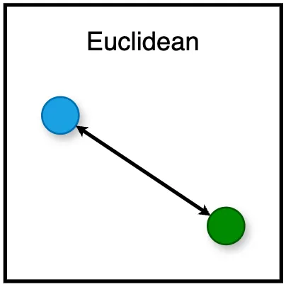
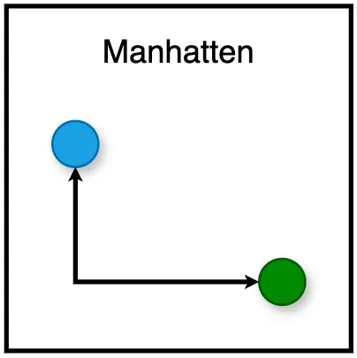
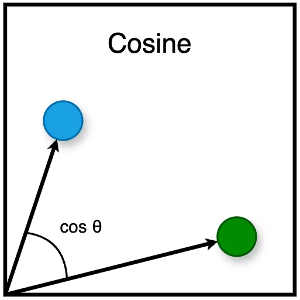
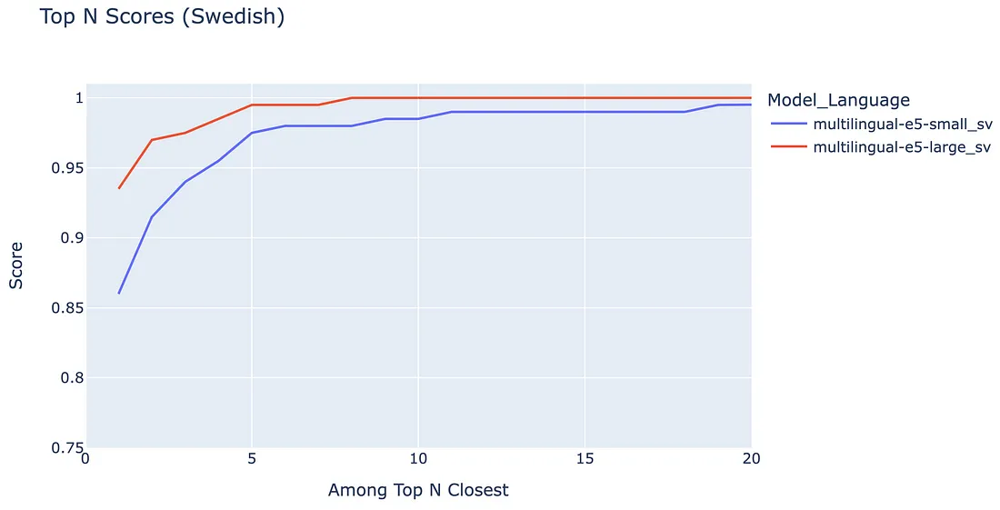
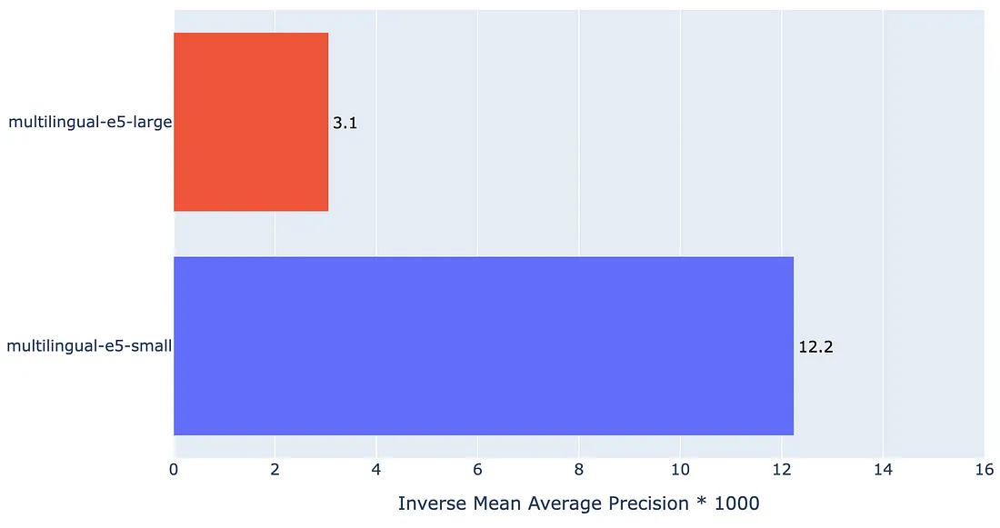
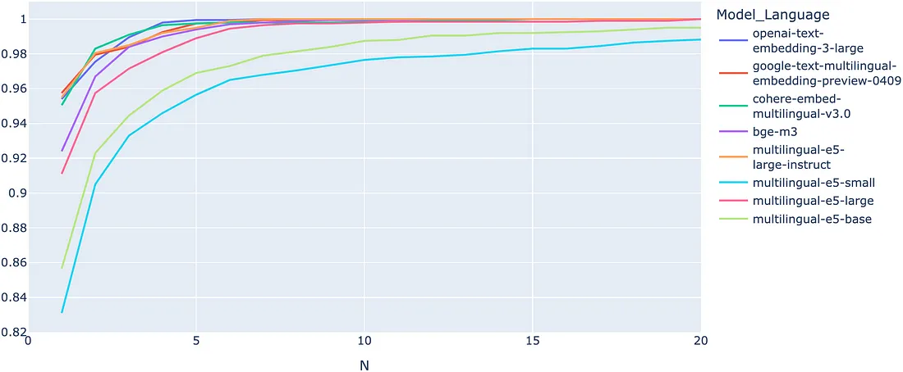
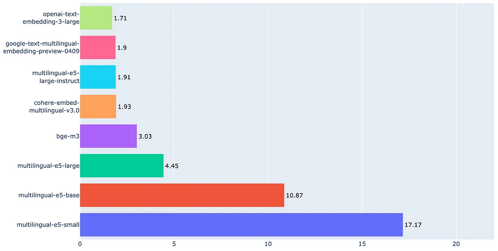
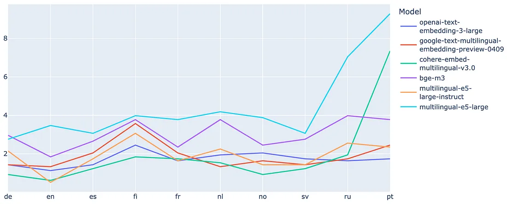
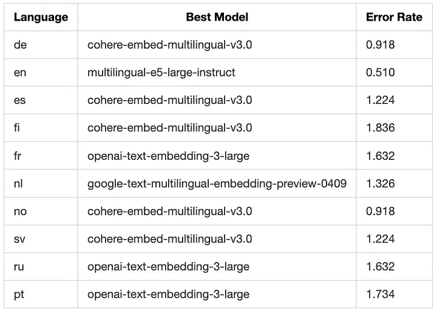

# Best Embedding Model 🌟 — OpenAI / Cohere / Google / E5 / BGE

So sánh chuyên sâu về các mô hình nhúng đa ngôn ngữ


### Chúng ta đang ở giữa một bước ngoặt trong lĩnh vực AI, với các công ty ngày càng chuyển từ việc chỉ dựa vào các mô hình nội bộ sang sử dụng APIs từ các nhà cung cấp hàng đầu toàn cầu.

Các công ty như OpenAI, Google, Cohere, và Anthropic hiện đang thống trị thị trường LLM (Large Language Model) toàn cầu mới này, nhằm giải quyết các nhiệm vụ Natural Language Processing (NLP) trên toàn thế giới.

Song song với đó, các Text Embedding API đột phá, rất quan trọng cho nhiều ứng dụng khác nhau, đã xuất hiện; và chúng ta đang chứng kiến một cuộc chiến giữa các gã khổng lồ để cung cấp dịch vụ embedding đa ngôn ngữ tốt nhất.

Microsoft đã áp dụng một cách tiếp cận độc đáo bằng cách open-source một mô hình embedding đa ngôn ngữ gọi là E5, qua đó làm tăng độ sâu cho môi trường cạnh tranh. Và Viện Trí tuệ Nhân tạo Bắc Kinh gần đây đã ra mắt một mô hình đa ngôn ngữ cạnh tranh mới, được biết đến với tên gọi BGE-M3.

Là một Kỹ sư Machine Learning giàu kinh nghiệm chuyên về phát triển sản phẩm cho sử dụng đa ngôn ngữ, tôi thấy những tiến bộ này đặc biệt thú vị và đã quyết định so sánh các công nghệ tiên tiến nhất trong lĩnh vực này.

Hôm nay, tôi sẽ trình bày một phân tích hiệu suất độc lập của các mô hình embedding đa dạng tập trung vào hiệu quả của chúng trên các truy vấn trong nhiều ngôn ngữ.

So sánh này bao gồm các nền tảng hàng đầu OpenAI, Google, và Cohere, cùng với các mô hình open-source có hiệu suất hàng đầu, để làm nổi bật sức mạnh tương đối của chúng trong bối cảnh AI đang phát triển nhanh chóng!

Note: Nếu những bài viết như thế này khơi gợi sự quan tâm của bạn, hãy cân nhắc theo dõi tôi để nhận được nhiều thông tin chi tiết hơn trong tương lai!


### Models To Compare ⚖️

Tôi đã bao gồm các mô hình nổi bật nhất cho sự so sánh này — bao gồm cả closed-sourced và open-source. Dưới đây là tổng quan về các mô hình khác nhau cùng với ví dụ về cách tôi sử dụng chúng.

#### OpenAI Embeddings
OpenAI cung cấp một closed-sourced API cho các text embeddings đa ngôn ngữ.

Mô hình embedding mới nhất của họ, `text-embedding-3-large`, được phát hành vào ngày 25 tháng 1, 2024, là một mô hình đa ngôn ngữ gốc và hỗ trợ 256, 1024, và 3072 dimensions.

Mặc định, `text-embedding-3-large` trả về embedding với 3072 dimensions.

##### Ví dụ sử dụng:

```python
from openai import OpenAI
import os

OPENAI_API_KEY = os.environ.get("OPENAI_API_KEY", "")
openai_client = OpenAI(api_key=OPENAI_API_KEY)

def openai_embed(query: str, model="text-embedding-3-large"):
    query = query.replace("\n", " ")
    response = openai_client.embeddings.create(input=[query], model=model)
    embedding = response.data[0].embedding
    return embedding

# Example usage (3072 dimensions)
embeddings = openai_embed("This is a text I want to embed")
```

Xem tài liệu: [https://platform.openai.com/docs/guides/embeddings](https://platform.openai.com/docs/guides/embeddings)

API documentation cho dimension: [https://platform.openai.com/docs/api-reference/embeddings/create#embeddings-create-dimensions](https://platform.openai.com/docs/api-reference/embeddings/create#embeddings-create-dimensions)

### Cohere Embeddings

Cohere cung cấp một closed-sourced API cho các text embeddings đa ngôn ngữ.

Mô hình embedding mới nhất của họ, `embed-multilingual-v3.0`, được phát hành vào ngày 2 tháng 11, 2023, là một mô hình đa ngôn ngữ và trả về embedding với 1024 dimensions.

#### Ví dụ sử dụng:

```python
import cohere
import os

COHERE_API_KEY = os.environ.get("COHERE_API_KEY", "")
cohere_client = cohere.Client(COHERE_API_KEY)

def cohere_embed(query: str, model="embed-multilingual-v3.0"):
    response = cohere_client.embed(
      texts=[query],
      input_type="search_query",
      model=model
    )
    embedding = response.embeddings[0]
    return embedding

# Example usage (1024 dimensions)
embeddings = cohere_embed('This is a text I want to embed')
```

Xem tài liệu: [https://docs.cohere.com/docs/multilingual-language-models](https://docs.cohere.com/docs/multilingual-language-models)

### Google Embeddings

Google cung cấp một closed-sourced API cho các text embeddings đa ngôn ngữ.

Mô hình embedding mới nhất của họ, `text-multilingual-embedding-preview-0409`, được phát hành dưới dạng preview vào ngày 2 tháng 4, 2024, là một mô hình đa ngôn ngữ và trả về embedding với 768 dimensions.

Phiên bản này là một cải tiến so với mô hình embedding trước đó từ series gecko `textembedding-gecko-multilingual@001`.

#### Ví dụ sử dụng:

```python
from vertexai.preview.language_models import TextEmbeddingModel

def google_embed(query: str):
    embedder_name = "text-multilingual-embedding-preview-0409"
    model = TextEmbeddingModel.from_pretrained(embedder_name)
    embeddings_list = model.get_embeddings([query])
    embeddings = embeddings_list[0].values
    return embeddings

# Example usage (768 dimensions)
embeddings = google_embed("This is a text I want to embed")
```

Liên kết tới tài liệu: [https://cloud.google.com/vertex-ai/generative-ai/docs/embeddings/get-text-embeddings#latest_models](https://cloud.google.com/vertex-ai/generative-ai/docs/embeddings/get-text-embeddings#latest_models)

### Microsoft’s E5 Embeddings

Multilingual E5 là một mô hình embedding đa ngôn ngữ open-source được tạo ra bởi đội ngũ nghiên cứu của Microsoft.

Bản phát hành ban đầu bao gồm ba mô hình embedding — small, base, và large; phiên bản instruct được phát hành vào đầu năm 2024. Xem kích thước embedding dưới đây:

#### GitHub Source

#### Ví dụ sử dụng:

```python
from sentence_transformers import SentenceTransformer

def e5_embed(query: str, model: str):
    if model not in ['large', 'base', 'small', 'large-instruct']:
        raise ValueError(f'Invalid model name {model}')

    embedder = SentenceTransformer(f'intfloat/multilingual-e5-{model}')
    if model == 'large-instruct':
        task = 'Given a short informative text, retrieve relevant topics'
        query = f'Instruct: {task}\nQuery: {query}'

    embeddings = embedder.encode(sentences=[query], convert_to_tensor=False, normalize_embeddings=True)
    return embeddings

# Example usage (768 dimensions)
embeddings = e5_embed('This is a text I want to embed', model='base')
```

Xem báo cáo kỹ thuật: [https://arxiv.org/pdf/2402.05672.pdf](https://arxiv.org/pdf/2402.05672.pdf)

Mã GitHub: [https://github.com/microsoft/unilm/tree/master/e5](https://github.com/microsoft/unilm/tree/master/e5)

### BGE-M3

BGE-M3 là một mô hình embedding đa ngôn ngữ open-source được tạo ra bởi Viện Trí tuệ Nhân tạo Bắc Kinh.

Mô hình embedding mới nhất của họ, `BGE-M3`, được phát hành vào ngày 30 tháng 1, 2024, là một mô hình đa ngôn ngữ và trả về embedding với 1024 dimensions.

M3 đại diện cho Multi-linguality (100+ ngôn ngữ), Multi-granularities (độ dài đầu vào lên tới 8192), Multi-Functionality (hợp nhất của dense, lexical, multi-vec (colbert) retrieval) [source].

#### Ví dụ sử dụng:

```python
from FlagEmbedding import BGEM3FlagModel

def bge_m3_embed(query: str):
    # Có thể thêm "use_fp16=True" để tăng tốc dự đoán
    model = BGEM3FlagModel('BAAI/bge-m3', use_fp16=False)
    embeddings = model.encode([query])['dense_vecs'][0]
    return embeddings

# Example usage (1024 dimensions)
embeddings = bge_m3_embed("This is a text I want to embed")
```

Xem báo cáo kỹ thuật: [https://arxiv.org/pdf/2402.03216.pdf](https://arxiv.org/pdf/2402.03216.pdf)

### How to Evaluate Embedding Quality 🌟

Mục đích của sentence embeddings là để bao quát ý nghĩa ngữ nghĩa của toàn bộ câu vào các biểu diễn vector dense, hiệu quả chuyển đổi từ ngữ và ngữ cảnh của chúng thành một dạng số mà máy tính có thể hiểu được.

Về bản chất, embeddings chỉ là các biểu diễn số của câu, nơi các câu có ý nghĩa tương tự được đặt gần nhau trong không gian vector.

Điều này có nghĩa là chúng ta có thể đánh giá chất lượng của một mô hình embedding bằng cách embedding các câu tương tự về ý nghĩa ngữ nghĩa và đo lường xem các embeddings này gần nhau đến mức nào.

Để minh họa khái niệm, hãy xem xét hai câu sau:

“The weather is chilly and windy today.”
“It’s a cold and breezy day.”
Cả hai câu đều truyền tải ý nghĩa rất giống nhau bằng cách mô tả điều kiện thời tiết là lạnh với gió. Lý tưởng là embedding hai câu này nên dẫn đến các vector rất giống nhau.

Để hiểu hiệu quả hoặc chất lượng của các embeddings này, điều quan trọng là phải xem xét cách chúng ta có thể đo lường khoảng cách hoặc sự tương đồng giữa chúng, và đây là nơi các hàm khoảng cách (distance functions) trở nên quan trọng.

Có rất nhiều hàm khoảng cách mà chúng ta có thể sử dụng, mỗi hàm phục vụ cho một mục đích riêng.

Dưới đây là danh sách một số hàm khoảng cách được sử dụng rộng rãi nhất:

#### Euclidean Distance
Tính khoảng cách đường thẳng giữa hai điểm trong không gian vector. Nó nhạy cảm với độ lớn của các vector, với khoảng cách nhỏ hơn chỉ ra sự tương đồng lớn hơn.


#### Manhattan Distance
Tính khoảng cách giữa hai tọa độ bằng cách di chuyển theo các lưới thẳng (không phải đường ngắn nhất). Nó được tính bằng cách tổng các khác biệt tuyệt đối của các tọa độ trong mỗi chiều.


#### Cosine Similarity
Tính cosine của góc giữa hai vector, tập trung vào hướng thay vì độ lớn. Nó lý tưởng để đánh giá sự tương đồng ngữ nghĩa trong văn bản, vì nó đánh giá hướng của các embeddings. Giá trị gần 1 chỉ ra sự tương đồng cao. Giá trị gần 0 hoặc âm chỉ ra sự tương đồng thấp hoặc không có, với các giá trị âm gợi ý ý nghĩa đối lập.


---

Việc sử dụng các hàm khoảng cách này giúp chúng ta xác định chất lượng của các mô hình embedding bằng cách đo lường mức độ gần gũi của các câu có ý nghĩa tương tự trong không gian vector.

### Mặc dù Euclidean distance ban đầu có vẻ như là lựa chọn hợp lý nhất, nhưng nó gặp phải những thách thức đáng kể trong các không gian nhiều chiều. Khó khăn này phát sinh từ hiện tượng được gọi là “lời nguyền chiều cao” (curse of dimensionality).

Để đo lường sự tương đồng ngữ nghĩa giữa các dữ liệu văn bản, cosine similarity thường là phương pháp được ưu tiên trong ba phương pháp, chủ yếu do tính độc lập của nó với độ lớn của vector.

Lợi thế này xuất phát từ việc cosine similarity tính cosine của góc giữa hai vector, tập trung vào hướng mà các vector chỉ thay vì độ dài của chúng.

Cosine similarity hiệu quả trong việc chuẩn hóa độ lớn của vector, làm cho nó đặc biệt phù hợp để so sánh các văn bản có độ dài và mật độ nội dung khác nhau.

Vì vậy, chúng tôi sẽ sử dụng cosine similarity để đánh giá hiệu suất của các embeddings.

Chúng tôi sẽ truyền một loạt các câu bằng nhiều ngôn ngữ vào mô-đun đánh giá của chúng tôi để xác định mô hình embedding nào mang lại hiệu suất tốt nhất — nghĩa là mô hình chính xác nhất trong việc nắm bắt các mối quan hệ ngữ nghĩa trong các ngữ cảnh ngôn ngữ khác nhau.

### Evaluation Dataset 🔢

Tôi đã tạo một bộ dữ liệu chủ đề mà chúng ta có thể sử dụng cho việc đánh giá.

Bộ dữ liệu bao gồm 200 câu được phân loại dưới 50 chủ đề khác nhau (một số trong đó có liên quan chặt chẽ).

Dưới đây là một số ví dụ từ bộ dữ liệu:

- **Sailing and boating**: Many people find solace in the peacefulness of being out on the water.
- **The global economy**: Trade tensions between major economies continue to impact global markets.
- **The US stock market**: Wall Street’s indices reflect the pulse of American corporate and economic health.
- **Book reviews**: Discover the latest book reviews on bestsellers and hidden gems.
- **Religion and spirituality**: Many people find comfort and guidance in their religious beliefs.
- **AI for coding and software development**: The use of AI in software development is revolutionizing the industry.

Tôi đã sử dụng GPT-4 để dịch bộ dữ liệu này sang nhiều ngôn ngữ: Tiếng Anh 🇺🇸, Tiếng Tây Ban Nha 🇪🇸, Tiếng Pháp 🇫🇷, Tiếng Đức 🇩🇪, Tiếng Nga 🇷🇺, Tiếng Hà Lan 🇳🇱, Tiếng Bồ Đào Nha 🇵🇹, Tiếng Na Uy 🇳🇴, Tiếng Thụy Điển 🇸🇪, Tiếng Phần Lan 🇫🇮.

Go and check out the dataset for yourself: 'topic dataset - (https://github.com/LarsChrWiik/lars_datasets/tree/main/topics_dataset_50). 

### Rank-Based Evaluation — Top N 📈

Trước khi tôi trình bày kết quả cuối cùng từ việc đánh giá của mình, các metric được hiển thị cần được giải thích rõ ràng.

Cumulative Match Characteristic (CMC) curve là một cách hiển thị trực quan để thể hiện mức độ hiệu quả của một mô hình embedding trên một phổ các kịch bản.

Đường cong này rất quan trọng trong việc trình bày khả năng dự đoán của mô hình (trong trường hợp này là embedding phù hợp với một truy vấn nhất định) sẽ nằm trong các kết quả xếp hạng hàng đầu (top N-ranked results).

Hãy xem xét một ví dụ khi bạn có 200 câu và được giao nhiệm vụ xếp hạng 50 chủ đề dựa trên mức độ liên quan của chúng đến mỗi câu.

Chúng ta có thể đánh giá độ chính xác bằng cách quan sát thứ hạng được gán cho chủ đề đúng. Một dự đoán đặt chủ đề đúng ở thứ hạng 1 cho thấy độ chính xác xếp hạng xuất sắc, trong khi một dự đoán đặt chủ đề đúng ở thứ hạng 50 cho thấy hiệu suất tồi tệ nhất có thể.

Chúng ta có thể lặp qua N với 1 ≤ N ≤ 50 để tính xác suất của một chủ đề đúng được dự đoán nằm trong top N chủ đề phù hợp nhất.

Để đưa điều này vào thực tế, hãy xem xét ví dụ triển khai sau bằng Python:

```python
for N in range(1, 51):  # Bắt đầu từ 1, lên đến và bao gồm 50
    correct_topics = []
    for query, target_topic in zip(queries, topics):
        sim = cosine_similarity(query, topics)
        sim_sorted_idx = sim.argsort()
        topics_ordered = [topics[i] for i in sim_sorted_idx]
        top_N = topics_ordered[-N:]
        correct_topics.append(1 if target_topic in top_N else 0)
    CMC_score = round(sum(correct_topics) / len(correct_topics), 3)
    print(f"Top {N} CSC_score: {CMC_score}")
```

Trong đoạn mã này, `queries` đại diện cho các câu của chúng ta, và `topics` đại diện cho các chủ đề tiềm năng mà mỗi câu có thể liên quan đến. Hàm `cosine_similarity` đo lường sự tương đồng giữa mỗi câu và các chủ đề có thể có. Đối với mỗi N trong phạm vi xác định, chúng ta tính toán một điểm số từ 0 đến 1, trong đó 1 chỉ ra độ chính xác đủ trong việc dự đoán chủ đề mục tiêu trong top N kết quả phù hợp nhất.

Để minh họa Cumulative Match Characteristic trông như thế nào, hãy xem ví dụ của `multilingual-e5-small` cho tiếng Thụy Điển:

---

Ví dụ này cho thấy cách chúng ta có thể đánh giá và so sánh hiệu suất của các mô hình embedding thông qua việc sử dụng đường cong CMC và đánh giá mức độ chính xác của các dự đoán theo các thứ hạng khác nhau.


### Như chúng ta có thể thấy từ biểu đồ, khoảng 95% các câu có chủ đề đúng được xếp hạng trong top 4 vị trí đầu tiên — vì đường màu xanh vượt qua 0.95 khi N=4.

Như bạn có thể đã hiểu, độ chính xác chỉ có thể cải thiện với các giá trị N lớn hơn (vì nó tăng cơ hội chứa chủ đề mục tiêu).

Chúng ta có thể mở rộng biểu đồ này bằng cách thêm `multilingual-e5-large`, một mô hình được cho là có hiệu suất tốt hơn.

Hãy xem nó trông như thế nào:



### Như mong đợi, `multilingual-e5-large` (đường màu đỏ) nằm trên `multilingual-e5-small` (đường màu xanh) — chỉ ra hiệu suất tốt hơn cho tất cả các giá trị của N.

### Error Rate Evaluation 📈

Bên cạnh đường cong CMC, chúng ta có thể trực quan hóa biểu đồ cột về tỷ lệ thành công bằng cách tính Mean Average Precision (MAP).

Tuy nhiên, để trực quan hóa Tỷ lệ lỗi (Error Rate), chúng ta có thể tính nghịch đảo của MAP, Inverse Mean Average Precision (IMAP), điều này sẽ cung cấp cho chúng ta một metric tập trung vào các lỗi mà mô hình gặp phải thay vì thành công của nó.

IMAP tự nhiên là một số nhỏ vì hiệu suất trung bình của tất cả các giá trị có thể của N gần 1. Chúng ta có thể tỷ lệ lỗi bằng một hệ số 1000 để đưa nó vào một con số dễ hiểu hơn — giúp việc so sánh dễ dàng hơn.

IMAP được tính như sau:

```python
MAP = avg(cmc_score)
scale_rate = 1000  # Để so sánh số liệu dễ dàng hơn
IMAP = (1 - MAP) * scale_rate  # Còn được gọi là "tỷ lệ lỗi"
```

Hãy nhớ rằng khi hiển thị tỷ lệ lỗi, các giá trị gần 0 hơn chỉ ra hiệu suất tốt hơn.

Để minh họa Inverse Mean Average Precision trông như thế nào, hãy xem lại ví dụ của chúng ta với `multilingual-e5-small` và `multilingual-e5-large` cho tiếng Thụy Điển:

```python
import matplotlib.pyplot as plt

# Giả sử cmc_scores là danh sách các điểm số CMC cho mỗi giá trị của N
cmc_scores_small = [...]  # CMC scores for multilingual-e5-small
cmc_scores_large = [...]  # CMC scores for multilingual-e5-large

map_small = sum(cmc_scores_small) / len(cmc_scores_small)
map_large = sum(cmc_scores_large) / len(cmc_scores_large)

imap_small = (1 - map_small) * 1000
imap_large = (1 - map_large) * 1000

# Vẽ biểu đồ cột cho IMAP
models = ['multilingual-e5-small', 'multilingual-e5-large']
imap_values = [imap_small, imap_large]

plt.bar(models, imap_values, color=['blue', 'red'])
plt.xlabel('Embedding Model')
plt.ylabel('Inverse Mean Average Precision (IMAP)')
plt.title('Error Rate Comparison for Swedish')
plt.show()
```

Biểu đồ này sẽ cho thấy tỷ lệ lỗi của hai mô hình `multilingual-e5-small` và `multilingual-e5-large`, giúp dễ dàng so sánh hiệu suất của chúng.



### Như chúng ta có thể thấy, biểu đồ cho thấy lỗi tích lũy của mỗi mô hình embedding. Như mong đợi, `multilingual-e5-large` có tỷ lệ lỗi thấp hơn so với phiên bản nhỏ hơn của nó là `multilingual-e5-small` — chỉ ra rằng `multilingual-e5-large` là mô hình tổng thể tốt hơn cho tiếng Thụy Điển.

### Bây giờ, khi chúng ta đã hiểu hai metric CMC và IMAP, hãy chuyển sang kết quả.

### Results 📊

Cuộc điều tra của chúng tôi đã bao gồm nhiều ngôn ngữ (Tiếng Anh 🇺🇸, Tiếng Tây Ban Nha 🇪🇸, Tiếng Pháp 🇫🇷, Tiếng Đức 🇩🇪, Tiếng Nga 🇷🇺, Tiếng Hà Lan 🇳🇱, Tiếng Bồ Đào Nha 🇵🇹, Tiếng Na Uy 🇳🇴, Tiếng Thụy Điển 🇸🇪, và Tiếng Phần Lan 🇫🇮).

Nghiên cứu này sử dụng các đường cong Cumulative Match Characteristic và tỷ lệ Inverse Mean Average Precision như đã mô tả ở các phần trước, đây là các phương pháp để đo lường mức độ hiệu quả của các mô hình của chúng tôi.

Hãy xem các metric này khi chúng ta tính trung bình chúng trên tất cả các ngôn ngữ!

### Cumulative Match Characteristic (CMC) curve



Một đường cong CMC cao hơn chỉ ra hiệu suất ưu việt. Như chúng ta có thể suy luận từ biểu đồ, có sự phân biệt rõ ràng giữa các mô hình embedding hoạt động tồi nhất và tốt nhất.

Bây giờ, hãy kết hợp các điểm số từ biểu đồ cho tất cả các giá trị của N và tính toán IMAP (tỷ lệ lỗi).

Inverse Mean Average Precision (Tỷ lệ lỗi)



Một đường cong CMC cao hơn chỉ ra hiệu suất ưu việt. Như chúng ta có thể suy luận từ biểu đồ, có sự phân biệt rõ ràng giữa các mô hình embedding hoạt động tồi nhất và tốt nhất.

Bây giờ, hãy kết hợp các điểm số từ biểu đồ cho tất cả các giá trị của N và tính toán IMAP (tỷ lệ lỗi).

### Inverse Mean Average Precision (Tỷ lệ lỗi)



### Interpretation

Cuộc điều tra của chúng tôi nhằm xác định mô hình embedding hàng đầu trong số các ngôn ngữ được chọn.

Ban đầu, chúng tôi nhận thấy rằng OpenAI, Google, E5-Instruct và Cohere nổi bật so với các đối thủ khác, với OpenAI nhỉnh hơn một chút do tỷ lệ lỗi trung bình thấp hơn trên tất cả các ngôn ngữ.

Khi xem xét kỹ lưỡng hơn về hiệu suất của từng ngôn ngữ, câu chuyện trở nên phức tạp hơn.

Cohere nổi bật như một mô hình hàng đầu trong một số ngôn ngữ, vượt trội hơn các mô hình khác trong một nửa số ngôn ngữ được thử nghiệm. Tuy nhiên, đáng chú ý rằng nó hiệu suất kém hơn đáng kể trong tiếng Bồ Đào Nha, điều này gợi ra một cái nhìn rộng hơn về sự nhất quán của hiệu suất của các mô hình.

Dưới đây là một cái nhìn tổng quan về mô hình hoạt động tốt nhất cho mỗi ngôn ngữ:



Mặc dù Cohere hoạt động tốt trong một số ngôn ngữ nhất định, một mô hình embedding đa ngôn ngữ tối ưu nên cho thấy kết quả nhất quán trên một loạt rộng lớn các ngôn ngữ đa dạng.

OpenAI là một ví dụ điển hình về sự nhất quán này khi hiệu suất của nó vẫn ổn định qua các phân tích của chúng tôi. Điều này gợi ra rằng OpenAI xuất sắc trong việc tạo ra các embedding mạnh mẽ, có tính ứng dụng phổ quát.

Tuy nhiên, cần lưu ý rằng tập dữ liệu chủ đề được tạo ra bởi GPT4 (của OpenAI), điều này có thể gây ra độ chệch hiệu suất khi sử dụng mô hình embedding của OpenAI. Với những điều đó, Cohere vẫn vượt trội so với OpenAI trong hầu hết các ngôn ngữ như được hiển thị trong bảng ở trên.

Quan sát này gợi ra rằng việc bao gồm nhiều ngôn ngữ hơn trong các phân tích trong tương lai có thể làm nổi bật hơn các điểm mạnh của các mô hình, củng cố sự quan trọng của tính linh hoạt và khả năng mở rộng của chúng trên một phạm vi ngôn ngữ rộng lớn.

### Kết luận 💡

Phân tích này làm sáng tỏ về cảnh quan phức tạp của các công nghệ embedding đa ngôn ngữ.

Trong khi OpenAI, Google và Cohere là các lực lượng dẫn đầu trong lĩnh vực mô hình ngôn ngữ lớn độc quyền, phân tích này thể hiện hiệu suất tối ưu của họ trong việc tạo ra embedding đa ngôn ngữ.

Đặc biệt đáng chú ý là sự ổn định của OpenAI qua các ngôn ngữ khác nhau, hiệu suất mạnh mẽ của Cohere trong một nhóm ngôn ngữ được chọn và hiệu suất tổng thể của Google với kích thước embedding nhỏ.

Hơn nữa, tác động của các mô hình mã nguồn mở như E5-Instruct và BGE-M3 không thể bị coi thường. Những mô hình này không chỉ làm phong phú cảnh quan cạnh tranh mà còn thể hiện tiềm năng của sự đổi mới dựa trên cộng đồng trong lĩnh vực AI.

Tôi muốn bày tỏ lòng biết ơn đến các nhóm nghiên cứu từ Microsoft cho các mô hình E5 cũng như Viện Trí tuệ Nhân tạo Bắc Kinh cho BGE-M3. Đóng góp đáng kể của họ làm phong phú thêm cảnh quan cạnh tranh.