# Revolutionizing Retrieval-Augmented Generation with Enhanced PDF Structure Recognition

## Tóm tắt

Với sự phát triển nhanh chóng của các Mô hình Ngôn ngữ Lớn (LLMs), Phương pháp Sinh Dữ Liệu Kết Hợp Truy Xuất (RAG) đã trở thành phương pháp chính trong lĩnh vực trả lời câu hỏi dựa trên kiến thức chuyên môn. Hiện tại, các công ty mô hình nền tảng lớn đã mở các giao diện Embedding và Chat API, và các khung làm việc như LangChain đã tích hợp quá trình RAG. Dường như các mô hình và bước chính trong RAG đã được giải quyết, dẫn đến câu hỏi: liệu hệ thống trả lời câu hỏi kiến thức chuyên môn có đang tiến đến sự hoàn hảo?

Bài viết này phát hiện rằng các phương pháp hiện tại phụ thuộc vào việc truy cập vào các kho văn bản chất lượng cao. Tuy nhiên, do tài liệu chuyên môn chủ yếu được lưu trữ dưới dạng PDF, độ chính xác thấp của việc phân tích PDF ảnh hưởng đáng kể đến hiệu quả của việc trả lời câu hỏi dựa trên kiến thức chuyên môn. Chúng tôi đã thực hiện một thí nghiệm RAG thực nghiệm trên hàng trăm câu hỏi từ các tài liệu chuyên môn thực tế. Kết quả cho thấy, ChatDOC (chatdoc.com), một hệ thống RAG được trang bị bộ phân tích PDF toàn diện và chính xác, truy xuất các đoạn văn bản chính xác và đầy đủ hơn, do đó cung cấp câu trả lời tốt hơn. Các thí nghiệm thực nghiệm cho thấy ChatDOC vượt trội so với phương pháp cơ bản ở gần 47% câu hỏi, đồng đều ở 38% trường hợp, và chỉ kém ở 15% trường hợp. Điều này cho thấy chúng ta có thể cách mạng hóa RAG với sự nhận dạng cấu trúc PDF được cải tiến.

## 1 Giới thiệu

Các mô hình ngôn ngữ lớn (LLM) được huấn luyện trên dữ liệu chủ yếu đến từ các nguồn internet công khai, bao gồm trang web, sách, tin tức và văn bản đối thoại. Điều này có nghĩa là LLM chủ yếu dựa vào các nguồn internet làm dữ liệu huấn luyện, những nguồn này rộng lớn, đa dạng và dễ dàng truy cập, hỗ trợ chúng mở rộng khả năng của mình. Tuy nhiên, trong các ứng dụng dọc, các nhiệm vụ chuyên môn yêu cầu LLM sử dụng kiến thức chuyên ngành, điều này đáng tiếc là riêng tư và không phải là một phần của dữ liệu tiền huấn luyện.

Một phương pháp phổ biến để trang bị cho LLM kiến thức chuyên ngành là Phương pháp Sinh Dữ Liệu Kết Hợp Truy Xuất (RAG). Khung RAG trả lời một câu hỏi qua bốn bước: người dùng đưa ra câu truy vấn, hệ thống truy xuất nội dung liên quan từ các cơ sở kiến thức riêng tư, kết hợp nó với truy vấn của người dùng làm ngữ cảnh, và cuối cùng yêu cầu LLM tạo ra câu trả lời. Điều này được minh họa trong Hình 1 với một ví dụ đơn giản. Quá trình này phản ánh quá trình nhận thức điển hình của việc gặp vấn đề, bao gồm việc tham khảo các tài liệu liên quan và sau đó đưa ra câu trả lời. Trong khung làm việc này, thành phần then chốt là việc truy xuất thông tin liên quan chính xác, điều này rất quan trọng đối với hiệu quả của mô hình RAG.

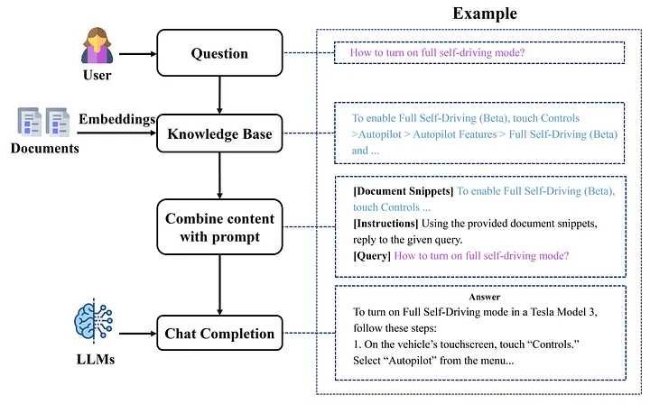

Tuy nhiên, quá trình truy xuất từ các tệp PDF gặp nhiều thách thức. Các vấn đề phổ biến bao gồm sự không chính xác trong việc trích xuất văn bản và sự lộn xộn trong các mối quan hệ hàng-cột của bảng bên trong các tệp PDF. Do đó, trước khi thực hiện RAG, chúng ta cần chuyển đổi các tài liệu lớn thành nội dung có thể truy xuất. Quá trình chuyển đổi bao gồm một số bước, như được minh họa trong Hình 2:

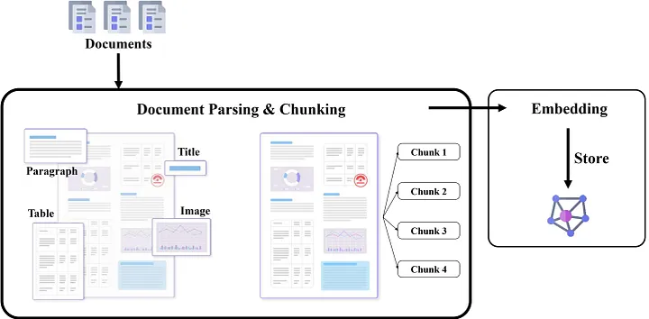
### Phân tích & Chia nhỏ Tài liệu

Quá trình này bao gồm việc trích xuất các đoạn văn, bảng biểu và các khối nội dung khác, sau đó chia nhỏ nội dung đã trích xuất thành các phần nhỏ để truy xuất sau này.

### Chuyển đổi Embedding

Quá trình này chuyển đổi các phần văn bản thành các vector giá trị thực và lưu trữ chúng trong cơ sở dữ liệu.

Do mỗi bước này có thể dẫn đến mất mát thông tin, các mất mát cộng dồn có thể ảnh hưởng đáng kể đến hiệu quả của các phản hồi từ RAG.

Bài báo này chủ yếu giải quyết câu hỏi liệu chất lượng của việc phân tích và chia nhỏ PDF có ảnh hưởng đến kết quả của RAG hay không. Chúng tôi sẽ khám phá các thách thức, phương pháp và các nghiên cứu trường hợp thực tế liên quan đến vấn đề này. Bài báo sẽ bao gồm việc kiểm tra hai loại phương pháp trong lĩnh vực này, cụ thể là phương pháp dựa trên quy tắc và phương pháp dựa trên học sâu, tiếp theo là đánh giá thực nghiệm về hiệu quả của chúng thông qua các ví dụ thực tiễn.

## 2 Phân tích & Chia nhỏ PDF

### 2.1 Tổng quan về Thách thức và Phương pháp

Đối với con người, quá trình nhận thức khi xem bất kỳ trang tài liệu nào là tương tự nhau. Khi chúng ta đọc một trang, các ký tự được ghi nhận bởi võng mạc. Sau đó, trong não của chúng ta, các ký tự này được tổ chức thành các đoạn văn, bảng biểu và biểu đồ, và sau đó được hiểu hoặc ghi nhớ. Tuy nhiên, máy tính nhận thông tin dưới dạng mã nhị phân. Từ góc nhìn của chúng, như minh họa trong Hình 3, tài liệu có thể được phân loại thành hai loại chính:

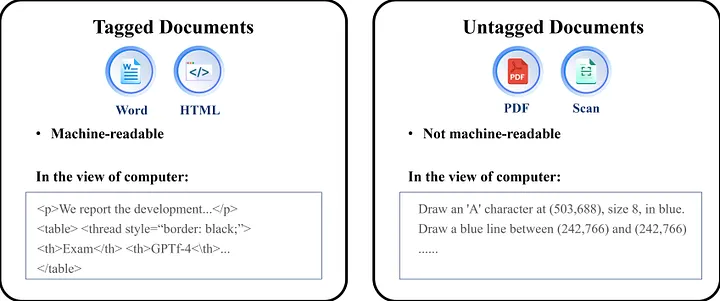

### Tài liệu có gắn thẻ

Ví dụ bao gồm các tài liệu Microsoft Word và HTML, chứa các thẻ đặc biệt như `
` và `<table>` để tổ chức văn bản thành các đoạn, ô và bảng.

### Tài liệu không gắn thẻ

Ví dụ bao gồm các tệp PDF, lưu trữ các hướng dẫn về vị trí của các ký tự, dòng và các yếu tố nội dung khác trên mỗi trang tài liệu. Chúng tập trung vào việc 'vẽ' các yếu tố nội dung cơ bản này theo cách giúp tài liệu dễ đọc đối với con người. Chúng không lưu trữ bất kỳ thông tin cấu trúc nào của tài liệu, như bảng hoặc đoạn văn. Do đó, tài liệu không gắn thẻ chỉ dành cho con người đọc, nhưng không thể đọc được bởi máy tính. Điều này trở nên rõ ràng khi cố gắng sao chép một bảng từ PDF sang MS Word, nơi cấu trúc ban đầu của bảng thường bị mất hoàn toàn.

Tuy nhiên, các Mô hình Ngôn ngữ Lớn (LLMs) thể hiện khả năng xử lý văn bản nối tiếp một cách thành thạo. Do đó, để cho phép LLMs quản lý hiệu quả các tài liệu không gắn thẻ, cần một bộ phân tích tổ chức các ký tự rời rạc thành các văn bản mạch lạc với cấu trúc của chúng. Lý tưởng nhất, một Bộ phân tích PDF nên có các tính năng chính sau:

- **Nhận diện cấu trúc tài liệu**: Nó nên chia các trang thành các loại khối nội dung khác nhau như đoạn văn, bảng biểu và biểu đồ. Điều này đảm bảo rằng các khối văn bản được chia là các đơn vị ngữ nghĩa hoàn chỉnh và độc lập.
- **Khả năng hoạt động tốt với bố cục tài liệu phức tạp**: Nó nên hoạt động tốt ngay cả với các trang tài liệu có bố cục phức tạp, chẳng hạn như các trang nhiều cột, bảng không có đường viền và thậm chí cả các bảng có ô hợp nhất.

Hiện tại, có hai phương pháp chính để phân tích PDF: phương pháp dựa trên quy tắc và phương pháp dựa trên học sâu. Trong số đó, PyPDF, một bộ phân tích dựa trên quy tắc được sử dụng rộng rãi, là phương pháp tiêu chuẩn trong LangChain để phân tích PDF. Ngược lại, phương pháp của chúng tôi, Bộ phân tích PDF ChatDOC (https://pdfparser.io/), dựa trên các mô hình học sâu. Tiếp theo, chúng tôi sẽ minh họa sự khác biệt giữa chúng bằng cách giới thiệu các phương pháp và tìm hiểu một số trường hợp thực tế.

### 2.2 Phương pháp dựa trên quy tắc: PyPDF

Trước tiên, chúng tôi giới thiệu quy trình phân tích và chia nhỏ dựa trên PyPDF. Đầu tiên, PyPDF nối tiếp các ký tự trong PDF thành một chuỗi dài mà không có thông tin cấu trúc tài liệu. Sau đó, chuỗi này trải qua quá trình phân đoạn thành các khối rời rạc, sử dụng một số quy tắc phân đoạn, chẳng hạn như hàm “RecursiveCharacterTextSplitter” trong LangChain. Cụ thể, hàm này chia tài liệu dựa trên danh sách các ký tự phân tách đã được định trước, chẳng hạn như ký tự xuống dòng “\n”. Sau khi phân đoạn ban đầu, các khối liền kề chỉ được gộp lại nếu độ dài của các khối kết hợp không vượt quá giới hạn định trước là N ký tự. Sau đây, chúng tôi sử dụng “PyPDF” để chỉ phương pháp phân tích và chia nhỏ tài liệu sử dụng PyPDF+RecursiveCharacterTextSplitter, với điều kiện không có sự mơ hồ về ngữ cảnh. Độ dài tối đa của một khối được đặt là 300 token trong phần tiếp theo. Tiếp theo, chúng tôi sử dụng một trường hợp để quan sát bản chất của PyPDF.

Trường hợp 1 trong Hình 4 là một trang từ tài liệu có sự pha trộn giữa bảng và văn bản hai cột, nơi ranh giới của chúng rất khó phân biệt. Các hàng ở giữa bảng không có đường kẻ ngang, làm cho việc nhận dạng các hàng trong bảng trở nên khó khăn. Và các đoạn văn có bố cục một cột (cho các ghi chú bên dưới bảng) và bố cục hai cột (cho các đoạn văn ở phần dưới của trang).

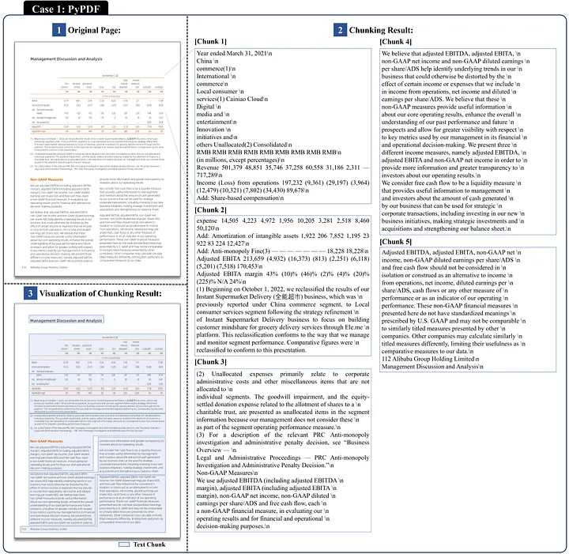

Kết quả phân tích và phân đoạn của PyPDF được hiển thị trong Hình 4. Trong phần "3 Visualization", chúng ta có thể thấy rằng PyPDF nhận diện đúng các phần bố cục một cột và hai cột của trang. Nhưng có ba điểm yếu của PyPDF:

1. Nó không thể nhận dạng ranh giới của đoạn văn và bảng. Nó chia nhầm bảng thành hai phần và kết hợp phần thứ hai với đoạn văn tiếp theo thành một đoạn.
2. PyPDF có vẻ tốt trong việc phát hiện ranh giới của một đoạn văn, vì nó không chia một đoạn văn thành nhiều phần. Nhưng thực sự nó không phân tích ranh giới của một đoạn văn. Trong phần "2 Kết Quả Phân Đoạn" chúng ta có thể thấy rằng mỗi dòng văn bản trực quan trên trang được phân tích như một dòng kết thúc bằng "\n" trong kết quả, và không có định dạng đặc biệt ở cuối một đoạn văn. Nó phân đoạn đoạn văn đúng vì chúng tôi sử dụng một bộ phân tách đặc biệt "\n" coi một dòng kết thúc bằng dấu chấm là có khả năng là cuối của một đoạn văn. Tuy nhiên, cách tiếp cận này có thể không đúng trong nhiều trường hợp.
3. Nó không thể nhận diện cấu trúc bên trong một bảng. Trong phần "2 Kết Quả Phân Đoạn", trong chunk1, phần trên của bảng được biểu diễn dưới dạng một chuỗi các cụm từ ngắn, nơi một ô có thể bị chia thành nhiều dòng (ví dụ: ô "Thương mại Trung Quốc (1)") và một số ô liền kề có thể được sắp xếp thành một dòng (ví dụ: ô thứ ba đến ô thứ năm trong dòng thứ hai, "dịch vụ (1) Cainiao Cloud"). Do đó, cấu trúc của bảng bị phá hủy hoàn toàn. Nếu chunk này được truy xuất cho RAG, LLM không thể nhận thức bất kỳ thông tin ý nghĩa nào từ nó. Tình huống tương tự cho Chunk 2. Hơn nữa, tiêu đề của bảng chỉ tồn tại trong Chunk 1, vì vậy phần dưới của bảng trong Chunk 2 trở nên không ý nghĩa.
4. Nó không thể nhận diện thứ tự đọc của nội dung. Dòng cuối cùng của Chunk 5, "Quản lý Thảo Luận và Phân Tích", thực sự được đặt ở đầu trang, nhưng được phân tích là câu cuối cùng trong kết quả. Điều này là do PyPDF phân tích tài liệu theo thứ tự lưu trữ của các ký tự, thay vì thứ tự đọc của chúng. Điều này có thể gây ra kết quả hỗn loạn khi đối mặt với các bố cục phức tạp.
5. Kết quả trên trường hợp khác Case 2 với một bảng phức tạp và bắt ngang được hiển thị trong Hình 15 trong Phụ Lục.

## 2.3 Phương Pháp Dựa Trên Học Sâu: ChatDOC PDF Parser
Tiếp theo, chúng ta chuyển sự chú ý của mình đến phương pháp phân tích dựa trên học sâu, được minh họa bởi ChatDOC PDF Parser của chúng tôi. ChatDOC PDF Parser (https://pdfparser.io/) đã được huấn luyện trên một tập hợp các trang tài liệu lớn hơn mười triệu trang. Theo phương pháp trong [2], nó tích hợp một chuỗi các bước tinh vi, bao gồm:
- OCR và Phân Định Vị Văn Bản;
- Phát hiện đối tượng tài liệu vật lý;
- Cắt tỉa bắt ngang và bắt ngang qua trang;
- Xác định thứ tự đọc;
- Nhận diện cấu trúc bảng;
- Nhận diện cấu trúc logic tài liệu.

Độc giả có thể tham khảo [2] để biết chi tiết về những bước này. Sau khi phân tích, chúng tôi sử dụng các đoạn văn và bảng làm khối cơ bản, và hợp nhất các khối kề nhau cho đến khi đạt đến giới hạn token để tạo thành một chunk.

ChatDOC PDF Parser được thiết kế để liên tục cung cấp kết quả phân tích dưới dạng JSON hoặc HTML, ngay cả đối với các tập tin PDF khó khăn. Nó phân tích một tài liệu thành các khối nội dung trong đó mỗi khối đề cập đến một bảng, đoạn văn, biểu đồ hoặc loại khác. Đối với các bảng, nó đầu ra văn bản trong mỗi ô bảng và cũng cho biết các ô nào được hợp nhất thành một ô mới. Hơn nữa, đối với tài liệu có tiêu đề phân cấp, nó đầu ra cấu trúc phân cấp của tài liệu. Tóm lại, kết quả được phân tích giống như một tệp Word được tổ chức tốt. Hình 5 hiển thị một trang sao chụp và kết quả phân tích của nó. Phía bên trái hiển thị tài liệu và các khối nội dung được nhận dạng (với các hình chữ nhật có màu sắc khác nhau). Phía bên phải hiển thị kết quả phân tích dưới dạng JSON hoặc HTML. Độc giả có thể tham khảo [3] để xem demo trực tiếp của kết quả phân tích này.

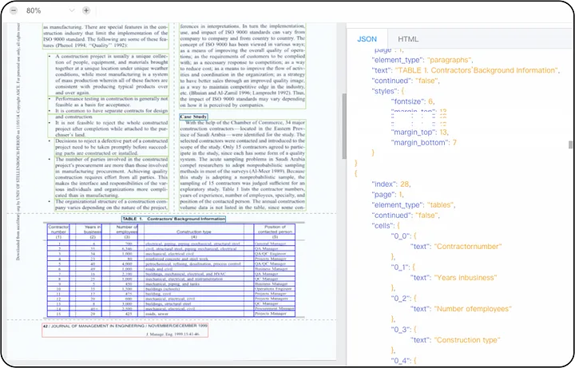

Sau đó, chúng tôi kiểm tra kết quả của ChatDOC PDF Parser trên Trường hợp 1 trong Hình 6. Nó đã khắc phục thành công ba điểm yếu của PyPDF.

![Parsing and chunking results of ChatDOC PDF Parser on Case 1 (original document: [4]). Zoom in to see the details.](images/image6.png)

Như được hiển thị trong phần “3 Visualization”, nó nhận diện bố cục hỗn hợp và đặt chính xác toàn bộ bảng thành một đoạn riêng biệt. Đối với các đoạn văn, như được hiển thị trong chunk 2 trong phần “2 Kết Quả Phân Đoạn”, các dòng văn bản trong cùng một đoạn văn được gộp lại với nhau, giúp dễ dàng hiểu hơn.
Trong phần “2 Kết Quả Phân Đoạn”, trong Chunk 1, chúng ta có thể thấy bảng được biểu diễn bằng định dạng markdown, giữ nguyên cấu trúc nội bộ của bảng. Ngoài ra, ChatDOC PDF Parser có thể nhận diện các ô được gộp bên trong một bảng. Vì định dạng markdown không thể biểu diễn các ô được gộp, chúng tôi đặt toàn bộ văn bản trong ô gộp vào từng ô gốc trong định dạng markdown. Như bạn có thể thấy, trong Chunk 1, văn bản “Năm kết thúc ngày 31 tháng 3 năm 2021” lặp lại 9 lần, đại diện cho một ô gộp với 9 ô gốc ban đầu.
Hơn nữa, “Quản lý Thảo Luận và Phân Tích” và “112 Alibaba Group Holding Limited” được nhận diện là tiêu đề và chân trang của trang, và chúng được đặt ở đầu và cuối của kết quả phân tích, nhất quán với thứ tự đọc.
Kết quả trên một trường hợp khác của Trường hợp 2 có bảng phức tạp và bắt ngang trang được hiển thị trong Hình 16 trong Phụ Lục.

## 3 Thí Nghiệm Về Ảnh Hưởng Của Nhận Diện PDF Đối Với RAG
Quay lại chủ đề chính của bài báo này, liệu cách một tài liệu được phân tích và phân đoạn có ảnh hưởng đến chất lượng câu trả lời được cung cấp bởi hệ thống RAG hay không? Để trả lời câu hỏi này, chúng tôi đã tiến hành một thí nghiệm có hệ thống để đánh giá các tác động.

### 3.1 Đánh Giá Định Lượng Chất Lượng Câu Trả Lời RAG
#### 3.1.1 Thiết Lập
Chúng tôi đã so sánh hai hệ thống RAG như liệt kê trong Bảng 1:

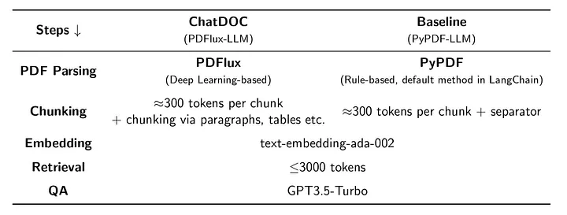

- ChatDOC: sử dụng ChatDOC PDF Parser để phân tích tài liệu và tận dụng thông tin cấu trúc cho việc phân đoạn.
- Baseline: sử dụng PyPDF để phân tích tài liệu và sử dụng chức năng RecursiveCharacterTextSplitter cho việc phân đoạn.

Các thành phần khác, như nhúng, truy xuất và QA, đều giống nhau cho cả hai hệ thống.

### 3.1.2 Chuẩn Bị Dữ Liệu
Đối với thí nghiệm của chúng tôi, chúng tôi đã tổng hợp một tập dữ liệu gần giống với điều kiện thực tế, bao gồm 188 tài liệu từ các lĩnh vực khác nhau. Cụ thể, bộ sưu tập này bao gồm 100 bài báo học thuật, 28 báo cáo tài chính và 60 tài liệu từ các danh mục khác như sách giáo khoa, tài liệu học phần và văn kiện pháp luật.

Sau đó, chúng tôi đã thu thập 800 câu hỏi được tạo ra bằng cách sử dụng crowd-sourcing. Sau khi lọc kỹ lưỡng, chúng tôi loại bỏ các câu hỏi chất lượng thấp và có được 302 câu hỏi để đánh giá. Các câu hỏi này được chia thành hai loại (như được hiển thị trong Bảng 2):

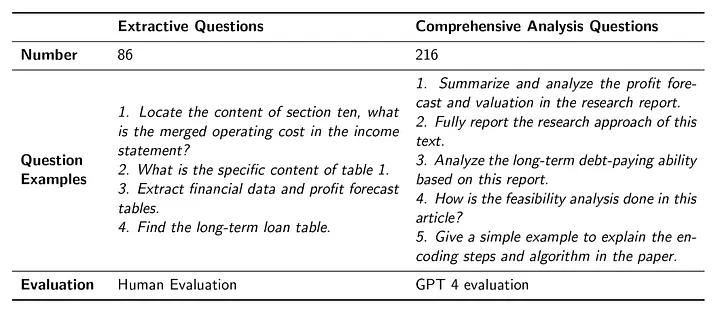

Các câu hỏi trích dẫn(Extractive questions) là những câu hỏi có thể được trả lời bằng các đoạn trích trực tiếp từ tài liệu. Thông thường, chúng yêu cầu câu trả lời cụ thể vì họ tìm kiếm thông tin cụ thể. Chúng tôi đã thấy khi sử dụng LLM cho việc đánh giá, nó có thể không phân biệt được những sự khác biệt tinh tế nhưng quan trọng giữa các câu trả lời, vì vậy chúng tôi phụ thuộc vào đánh giá của con người. Chúng tôi sử dụng một thang điểm từ 0-10 để đánh giá kết quả. Một người chú thích được cung cấp nội dung được truy xuất và câu trả lời của cả hai phương pháp và đánh giá hai phương pháp cùng một lúc. Chúng tôi hiển thị nội dung được truy xuất vì thường không thể đánh giá câu trả lời mà không có nội dung tài liệu, và hiển thị hai phương pháp cùng nhau để thúc đẩy so sánh chi tiết, đặc biệt là đối với các kết quả một phần chính xác.

Câu hỏi phân tích toàn diện (Comprehensive analysis questions) đòi hỏi tổng hợp thông tin từ nhiều nguồn và khía cạnh và đưa ra một tóm tắt. Khi câu trả lời dài và đòi hỏi hiểu biết toàn diện về nội dung tài liệu được cung cấp, chúng tôi thấy điều này khó khăn và tốn thời gian cho con người để đánh giá. Do đó, chúng tôi đã sử dụng GPT-4 để đánh giá chất lượng câu trả lời, đưa ra điểm từ 1-10. Chúng tôi cũng đánh giá kết quả của hai phương pháp trong một yêu cầu. Nhưng chúng tôi chỉ cung cấp nội dung được truy xuất mà không có câu trả lời vì câu trả lời dài (vì vậy tốn kém) so với các câu hỏi trích dẫn và nội dung được truy xuất tốt hơn có thể ngụ ý một câu trả lời tốt hơn (vì LLM được sử dụng là giống nhau). Một cặp kết quả của hai phương pháp được đánh điểm 4 lần để tránh thiên vị [5], và giá trị trung bình của chúng được sử dụng. Cụ thể, đối với một cặp nội dung (A, B) để so sánh cho cùng một câu hỏi, chúng tôi cung cấp cả A và B cho GPT-4 để so sánh và đánh giá họ hai lần. Chúng tôi cũng đảo ngược thứ tự của họ, cung cấp B và A cho GPT-4, và lặp lại yêu cầu hai lần.

### 3.1.3 Kết Quả
Kết quả của Các Câu Hỏi Trích Dẫn
Kết quả của các câu hỏi trích dẫn được hiển thị trong Bảng 3. Trong số 86 câu hỏi trích dẫn, ChatDOC đã hoạt động tốt hơn so với cơ sở trên 42 trường hợp, ngang bằng trên 36 trường hợp, và thấp hơn so với Baseline chỉ trên 8 trường hợp.

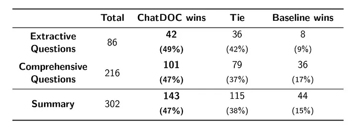

Phân phối các điểm đánh giá được chi tiết hơn trong Hình 7. Trong bảng phân phối, T_ij=k có nghĩa là có k câu hỏi mà câu trả lời bởi ChatDOC được đánh giá là i và câu trả lời bởi Baseline được đánh giá là j. Các trường hợp nơi ChatDOC đạt điểm cao hơn so với cơ sở (ChatDOC thắng) được đại diện trong nửa dưới bên trái, trong khi các trường hợp nơi cơ sở đạt điểm cao hơn nằm ở phía trên bên phải. Đáng chú ý, hầu hết các mẫu với một người chiến thắng rõ ràng đều nằm ở nửa dưới bên trái, chỉ ra sự ưu việt của ChatDOC. Đáng chú ý, ChatDOC đã đạt điểm đầy đủ (10) trong gần một nửa số trường hợp này, tổng cộng là 40.

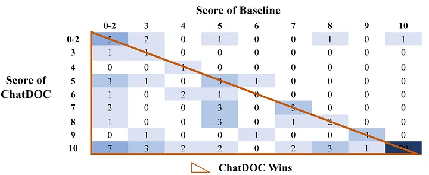

#### Kết quả của Các Câu Hỏi Phân Tích Toàn Diện
Kết quả của các câu hỏi phân tích toàn diện được hiển thị trong Bảng 3. Trong số 216 câu hỏi phân tích toàn diện, ChatDOC thực hiện tốt hơn so với điểm chuẩn trong 101 trường hợp, cùng điểm trong 79 trường hợp, và kém hơn so với điểm chuẩn chỉ trong 36 trường hợp.

Trong Hình 8, biểu đồ phân phối điểm cho các câu hỏi này cho thấy một sự tập trung dày đặc ở nửa phía dưới bên trái. Điều này cho thấy rằng ChatDOC thường xuyên thực hiện tốt hơn điểm chuẩn. Đáng chú ý, phần lớn các phát hiện của ChatDOC được điểm từ 8.5 đến 9.5, chứng tỏ một mức độ chất lượng phục hồi cao.

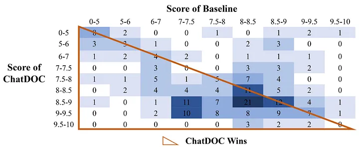

Tóm lại, ChatDOC vượt trội đáng kể so với Baseline, chủ yếu là do phương pháp phân tích PDF của nó xuất sắc.

### 3.2 Các Trường Hợp Nghiên Cứu của RAG
Để làm cho sự so sánh trở nên cụ thể hơn, chúng tôi hiển thị một số trường hợp mà ChatDOC chứng tỏ sự ưu việt của mình.

#### 3.2.1 Trường Hợp A — Tìm thông tin cụ thể trong hướng dẫn sử dụng của Tesla
Trường hợp A liên quan đến một truy vấn về hướng dẫn sử dụng của Tesla, đặc biệt là thông tin về dung tích hàng hóa. Đối với truy vấn này, ChatDOC và Baseline hoạt động khác nhau như được thể hiện trong Hình 9 và Hình 10. Các hình ảnh hiển thị phần mảnh vụ nào liên quan nhất được truy xuất và câu trả lời của LLM. Chúng cũng cho thấy trang tài liệu mà các phần mảnh vụ liên quan đến, và làm nổi bật những mảnh vụ này. Trong trường hợp này, cả hai mô hình đều định vị được bảng, nhưng văn bản họ cung cấp cho LLM là khác nhau, do đó câu trả lời cũng khác nhau. Cụ thể,

ChatDOC nhận biết cấu trúc của bảng, hiểu văn bản theo định dạng markdown (như được thể hiện trong phần “Mảnh Văn Bản Truy Xuất’’), điều này làm cho việc hiểu của mô hình ngôn ngữ dễ dàng hơn.
Baseline gộp nhầm bảng mục tiêu và bảng phía trên vào một mảnh và không có cấu trúc bảng. Do đó, văn bản trong mảnh không thể hiểu được (như được thể hiện trong phần “Mảnh Văn Bản Truy Xuất’’) và LLM chỉ có thể trả lời là “không được đề cập cụ thể’’.

![ChatDOC’s result on finding info in Tesla’s Manual (original document: [6]).](images/image12.png)

![Baseline’s result on finding info in Tesla’s Manual (original document: [6]).](images/image13.png)

Trường hợp này làm nổi bật hiệu quả của phương pháp phân tích của ChatDOC, đặc biệt là trong việc xử lý các bảng và trình bày chúng dưới dạng thân thiện với LLM.

#### 3.2.2 Trường Hợp B — Bài báo nghiên cứu
Trong Trường Hợp B, truy vấn của người dùng là về một bài báo nghiên cứu cụ thể. Nó yêu cầu hệ thống xác định “Bảng 8" trong bài báo và liệt kê tất cả các biến phụ thuộc mà nó liệt kê. Cả tiêu đề và nội dung của bảng đều cần thiết để xác định các biến này. Hình 11 và Hình 12 cho thấy cách ChatDOC và Baseline thực hiện trong trường hợp này.

![ChatDOC’s result on locating a specific table in a research paper (original document: [7]).](images/image14.png)

![Baseline’s result in locating a specific table in a research paper (original document: [7])](images/image15.png)

- ChatDOC hiệu quả trong việc truy xuất toàn bộ bảng, bao gồm cả tiêu đề và nội dung của nó. Việc truy xuất toàn diện này cho phép đáp ứng chính xác cho truy vấn.
- Baseline không truy xuất "Bảng 8" thực sự, mà chỉ là một mảnh văn bản dưới "Bảng 7" (vì nó chứa văn bản của "Bảng 8"). Do chiến lược phân đoạn của Baseline, nội dung của "Bảng 8" và nội dung khác trên cùng một trang được kết hợp thành một mảnh lớn. Mảnh này, chứa một sự pha trộn của nội dung không liên quan, có điểm tương đồng thấp và do đó không xuất hiện trong kết quả truy xuất.

Trường hợp này làm nổi bật khả năng vượt trội của ChatDOC trong xử lý các cấu trúc tài liệu phức tạp và ảnh hưởng của nó đối với việc truy xuất các đoạn cụ thể để đáp ứng chính xác.

### 3.3 Thảo Luận về Các Hạn Chế
Mặc dù ChatDOC thường thực hiện tốt, nhưng cũng có những trường hợp mà chất lượng truy xuất của nó không tốt bằng của Baseline. Chúng tôi quan sát hai mẫu trong những trường hợp này.

Vấn đề Xếp Hạng và Giới Hạn Token. Nếu ChatDOC truy xuất một bảng lớn, nhưng không liên quan trước tiên, nó sẽ sử dụng hết cửa sổ ngữ cảnh, ngăn chặn việc truy cập vào thông tin liên quan, như ví dụ trong Hình 13. Điều này chủ yếu là do mô hình nhúng không xếp hạng mảnh vụ liên quan là kết quả hàng đầu. Điều này có thể được giải quyết bằng một mô hình nhúng tốt hơn, hoặc một cách phức tạp hơn để xử lý các bảng/đoạn văn lớn như chỉ giữ lại phần liên quan của bảng cho LLM.

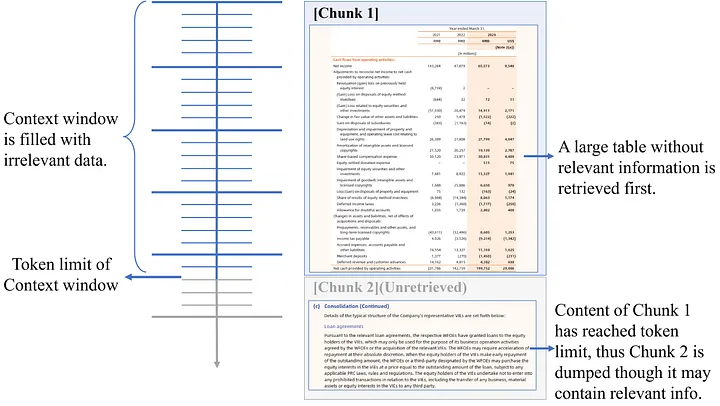

Nhược Điểm Phân đoạn Tốt(Fine Segmentation Drawback.). Hình 14 cho thấy một trường hợp yêu cầu truy xuất toàn bộ bảng với tiêu đề của nó. Tuy nhiên, ChatDOC nhận dạng sai tiêu đề là một đoạn văn thông thường, do đó tiêu đề và bảng được lưu trữ trong các mảnh khác nhau. Điều này dẫn đến việc chỉ truy xuất một phần của thông tin cần thiết, cụ thể là tiêu đề và chú thích dưới bảng, nhưng không phải là nội dung chính trong bảng. Cải thiện việc nhận dạng tiêu đề bảng có thể giải quyết các vấn đề này.

![An example that ChatDOC fails to retrieve the relevant table (original document: [8]).](images/image17.png)

## 4 Ứng Dụng của ChatDOC
Chúng tôi áp dụng khung nhận dạng cấu trúc PDF được cải thiện trên ChatDOC (chatdoc.com), một trợ lý đọc file AI giúp tóm tắt tài liệu dài, giải thích các khái niệm phức tạp và tìm kiếm thông tin chính trong vài giây.

Về độ tin cậy và độ chính xác, đó là sản phẩm hàng đầu trong tất cả các sản phẩm ChatPDF. Đây là những điều làm cho ChatDOC đặc biệt:

- Thạo việc xử lý bảng(Mastery over tables): Chỉ cần chọn bất kỳ bảng hoặc văn bản nào và nhảy ngay vào chi tiết.
- Cuộc trò chuyện với nhiều tập tin(Multi-file conversation): Nói về nhiều tài liệu cùng một lúc, mà không cần lo lắng về số trang mỗi tập tin có.
- Phản hồi được chứng minh(Citation-backed responses): Tất cả các câu trả lời được hỗ trợ bằng các trích dẫn trực tiếp được trích từ tài liệu nguồn.
- Xử lý Nhiều Loại Tệp(Handle Many File Types): Hoạt động một cách mượt mà với các tệp quét, định dạng ePub, HTML và docx.

Chúng tôi vẫn đang làm việc để xuất bản API của Bộ Phân Tích PDF của ChatDOC. Vui lòng đăng ký vào danh sách chờ qua pdfparser.io.

## 5 Kết Luận
Các Mô Hình Ngôn Ngữ Lớn (LLMs) có khả năng tạo ra các câu trả lời chính xác hơn khi được hỗ trợ bởi một bộ phân tích PDF hiệu quả trích xuất và tích hợp thông tin có cấu trúc từ tài liệu vào các lời nhắc. Quá trình này cải thiện chất lượng và tính liên quan của dữ liệu được cung cấp vào các mô hình, từ đó cải thiện đầu ra của chúng.

Trong tương lai, chúng tôi sẽ so sánh nhiều phương pháp phân tích tài liệu dựa trên học sâu để đưa ra một cái nhìn toàn diện hơn về mối quan hệ giữa chất lượng RAG và chất lượng phân tích tài liệu. Một số thí nghiệm ban đầu cho thấy một số phương pháp phân tích PDF mã nguồn mở không đạt được tiêu chuẩn cho RAG chất lượng cao.

## Tham Khảo
[1] Alibaba Group Holding Limited. Báo cáo hàng năm năm tài chính 2023. https://static.alibabagroup.com/reports/fy2023/ar/ebook/en/index.html, 2023.

[2] Rongyu Cao, Hongwei Li, Ganbin Zhou, và Ping Luo. Hướng tới phân đoạn toàn diện tài liệu với độ chính xác cao: Phương pháp và đánh giá. Trong Hội Nghị Quốc Tế thứ 16 về Phân Tích và Nhận Dạng Tài Liệu, trang 3–18, 2021.

[3] Nhóm ChatDOC. https://pdfparser.io/.

[4] Daisho Microline Holdings Limited. Báo cáo hàng năm tài chính 2022. https://www1.hkexnews.hk/listedco/listconews/sehk/2022/0626/2022062600094.pdf, 2022.

[5] Peiyi Wang, Lei Li, Liang Chen, Dawei Zhu, Binghuai Lin, Yunbo Cao, Qi Liu, Tianyu Liu, và Zhifang Sui. Các mô hình ngôn ngữ lớn không phải là các bộ đánh giá công bằng, 2023.

[6] Tesla Inc. Hướng dẫn sử dụng của Tesla Model 3. https://manual-directory.com/manual/2023-tesla-model-3-owners-manual/, 2023.

[7] Flávio Cunha, Fatih Karahan, và Ilton Soares. Lợi nhuận từ kỹ năng và phí cao học. Tạp Chí Tiền Tệ, Tín Dụng và Ngân Hàng, 43:39–86, 2011. https://sci-hub.hkvisa.net/https://doi.org/10.1111/j.1538-4616.2011.00410.x.

[8] Tom S. Vogl. Chiều cao, kỹ năng và kết quả thị trường lao động ở Mexico. Loạt Bài Nghiên Cứu Công việc NBER, 2012. https://www.nber.org/system/files/working_papers/w18318/w18318.pdf.

## Phụ lục: Thêm Các Trường Hợp về Phân Tích và Tách PDF
Trường hợp 2 trong Hình 15 đề cập đến một bảng lớn không có đường viền trải dài qua hai trang. Hình 15 cho thấy kết quả bởi PyPDF. Một cuộc kiểm tra kỹ lưỡng cho thấy rằng bảng được biểu diễn đơn giản chỉ là các chuỗi văn bản, làm cho chúng khó hiểu và phân tích. Và bảng này được phân tán thành ba phần. Kết quả trên hai trường hợp này cho thấy rằng phương pháp dựa trên quy tắc, như của PyPDF, thường tend to dissect một tài liệu mà không hiểu rõ cấu trúc nội dung của nó. Kết quả là, bảng thường bị phân rã và đoạn văn trở nên lộn xộn, dẫn đến một biểu diễn của tài liệu gốc không liên kết và rối rắm.

![Parsing and chunking results of PyPDF on Case 2 (original document: [4]). Zoom in to see the details.](images/image18.png)

Đối với Trình phân tích PDF của ChatDOC, như được hiển thị trong Hình 16, kết quả phân tích có sự khác biệt đáng kể. Nó không chỉ bảo tồn cấu trúc tài liệu mà còn phân đoạn tài liệu một cách hiệu quả theo cách giữ nguyên ý nghĩa bản chất của nó. Trong trường hợp này, bảng trải dài qua hai trang được đặt vào một phần, với tiêu đề ở đầu. Do đó, thông tin trong phần này là độc lập. Nếu phần này được truy xuất cho RAG, LLM có thể tiêu thụ thông tin hữu ích bên trong nó.

![Parsing and chunking result of ChatDOC PDF Parser on Case 2 (original document: [4]). Zoom in to see the details.](images/image19.png)

