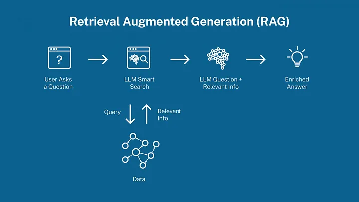
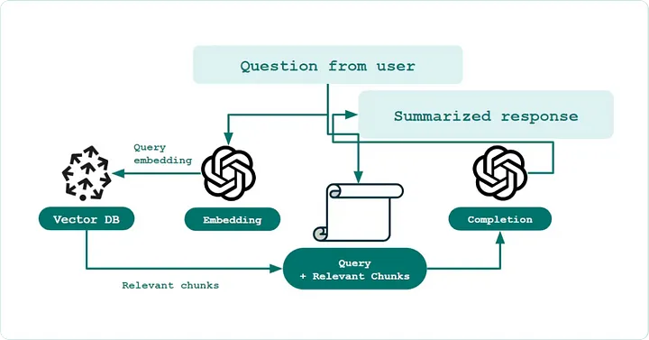
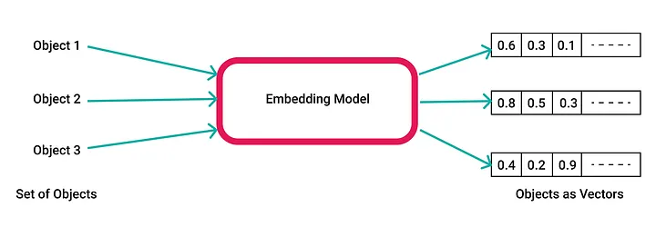
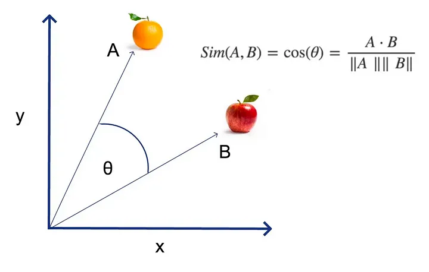
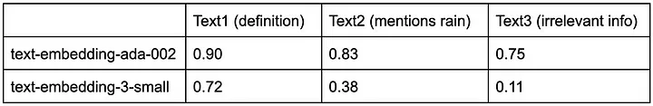
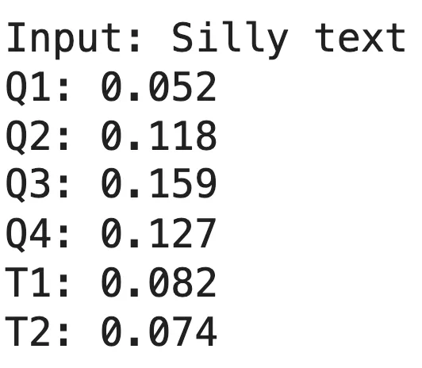

# Why Your RAG Doesn’t Work

RAG is still promising, but today it’s a DRAG

## 

Các doanh nghiệp đang thử nghiệm với Retrieval Augment Generation (RAG), nhưng có sự thất vọng lớn vì họ đang gặp khó khăn trong việc đưa những hệ thống này vào sản xuất. Không chỉ là RAG của họ hoạt động kém, họ còn không hiểu lý do tại sao và những bước tiếp theo cần làm.

Trong vài tháng qua, tôi đã nói chuyện với hàng chục đội ngũ AI và các chuyên gia. Thông qua những cuộc trò chuyện này và kinh nghiệm cá nhân, tôi đã tìm ra rằng một nguyên nhân chính cản trở hệ thống RAG là sự bất đồng ngữ nghĩa (semantic dissonance) — sự không nhất quán giữa ý nghĩa dự định của nhiệm vụ, sự hiểu biết của RAG về nó, và kiến thức cơ bản được lưu trữ. Và vì công nghệ cơ bản của vector embeddings rất phức tạp và khó hiểu, sự bất đồng tổng thể này rất khó chẩn đoán, làm cho nó trở thành một rào cản lớn để đưa vào sản xuất.

Mục tiêu của chúng tôi là làm rõ những lý do chính tại sao Vanilla RAG thất bại, và đưa ra các chiến thuật và chiến lược cụ thể để đưa RAG của bạn tiến thêm một bước gần hơn đến sản xuất.

Trong bài viết này, chúng tôi sẽ:

- Phân biệt giữa lời hứa của RAG ở dạng lý tưởng và thực tế của Vanilla RAG
- Giải thích cách sự bất đồng ngữ nghĩa xuất hiện
- Minh họa việc chẩn đoán và giảm bớt sự bất đồng ngữ nghĩa
- Kết thúc với các chiến lược bổ sung có ROI cao để đưa RAG của bạn sẵn sàng cho sản xuất
  (Lưu ý: Để đơn giản, chúng tôi tập trung vào các ví dụ dựa trên văn bản Q&A, nhưng các ý tưởng cốt lõi có thể áp dụng cho các trường hợp sử dụng khác).

### Tại sao lại là RAG?
RAG (Retrieval Augmented Generation) hiện đang trải qua một chu kỳ nổi tiếng. Nó nghe có vẻ hấp dẫn và, về cơ bản, là một công cụ tìm kiếm cho AI của bạn. Là một nhạc sĩ từng hy vọng, tôi ước ai đó đặt tên nó thành ROCK (Retrieval of Curated Knowledge?).

RAG trở nên phổ biến ngay sau khi GPT-3 trở thành một hiện tượng lớn. Một vấn đề ngay lập tức mà các doanh nghiệp gặp phải khi xây dựng AI dựa trên LLM là các mô hình như GPT không được đào tạo trên dữ liệu và lĩnh vực cụ thể của họ. Tuy nhiên, các nhà thực hành LLM nhanh chóng phát hiện ra rằng GPT hoạt động khá tốt khi bối cảnh cụ thể của doanh nghiệp (như tài liệu hỗ trợ) được cung cấp trực tiếp trong prompt. Điều này mang lại cho các doanh nghiệp một giải pháp thay thế cho nhiệm vụ đáng sợ là fine-tuning các mô hình.

Bước vào RAG. Về nguyên tắc, nó là một công cụ tìm kiếm chuyên biệt cho AI của bạn. Cung cấp một câu hỏi, có thể cùng với thông tin cụ thể của người dùng, và nó sẽ trả về ngữ cảnh phù hợp nhất cho GPT.

Mặc dù điều này nghe có vẻ tuyệt vời về lý thuyết, đã có những thách thức lớn trong việc hiện thực hóa các RAG đạt chuẩn sản xuất, mà chúng tôi sẽ khám phá trong các phần sau.



### RAG Đầy Hứa Hẹn, Vanilla RAG Chỉ Là Khởi Đầu

RAG chỉ là một framework, và một RAG hoạt động hoàn hảo, bất kể backend của nó, sẽ cung cấp giá trị to lớn cho vô số các trường hợp sử dụng. Trong phần này, chúng tôi cung cấp một tổng quan sư phạm về Vanilla RAG và các hoạt động cơ bản của tìm kiếm ngữ nghĩa (semantic search). Nếu bạn đã trải qua hành trình gian nan của việc lý giải, từ chối, và cuối cùng chấp nhận sự kỳ diệu của vector embeddings, thì có thể bỏ qua phần này.

**Vanilla RAG (định nghĩa):** Một công cụ tìm kiếm ngữ nghĩa một bước, lưu trữ kiến thức kinh doanh, chẳng hạn như tài liệu hỗ trợ, trong một vector database, chẳng hạn như Pinecone, sử dụng một mô hình embedding sẵn có. Việc truy xuất thông tin sau đó được thực hiện bằng cách tạo một vector embedding từ văn bản của câu hỏi và sử dụng một metric so sánh, chẳng hạn như cosine similarity, để xếp hạng top-k các tài liệu phù hợp nhất.



Hãy phân tích những ý tưởng này sâu hơn.

Một mô hình vector embedding lấy một chuỗi ký tự tùy ý và trả về một vector toán học có kích thước cố định. Các mô hình embedding phổ biến bao gồm OpenAI's text-embedding-ada-002 và mô hình mới nhất của họ là text-embedding-3-small. Những mô hình này chuyển đổi các đoạn văn bản thành các vector có khoảng ~1500 chiều và hầu như không có khả năng giải thích bởi con người.



Vectors là những công cụ phổ biến và cực kỳ hữu ích vì bạn có thể lấy những thứ phi định lượng và 1) phân tích chúng thành một loạt các chiều phong phú, và 2) so sánh chúng một cách định lượng. Một số ví dụ là:

- Bảng màu (đỏ, xanh lá cây, xanh dương) là một vector, trong đó mỗi giá trị nằm trong khoảng từ 0–255.
- Với các tiêu chuẩn ngành như Barra, cổ phiếu có thể được biểu diễn dưới dạng vector định lượng độ nhạy của nó đối với các yếu tố kinh tế như tăng trưởng rộng của Mỹ, thay đổi lãi suất, v.v.
- Các nền tảng như Netflix có thể phân tích sở thích của người dùng thành một vector, trong đó các thành phần có thể đại diện cho các thể loại và các đặc điểm khác.

Cosine similarity được cho là metric tiêu chuẩn để so sánh vectors trong tìm kiếm ngữ nghĩa, và nó hoạt động bằng cách áp dụng cosine vào góc giữa hai vectors thông qua dot product. Cosine càng gần 1, vectors càng giống nhau. (Có những cách khác để đo lường độ tương đồng ngữ nghĩa, nhưng thông thường đây không phải là nơi dễ dàng cải tiến, và chúng tôi sẽ sử dụng cosine similarity trong suốt bài viết này).



Tuy nhiên, không thể nhấn mạnh đủ rằng các metric so sánh vector như cosine similarity rất tinh tế để làm việc vì chúng không có ý nghĩa tuyệt đối — Các giá trị hoàn toàn phụ thuộc vào mô hình embedding và ngữ cảnh của văn bản liên quan. Giả sử bạn ghép một câu hỏi với một câu trả lời và nhận được cosine similarity là 0.73. Đây có phải là một kết quả tốt?

Như một minh họa nhanh, hãy lấy câu hỏi, “What is rain?”, và so sánh nó với ba văn bản có mức độ liên quan khác nhau. Chúng ta thấy trong bảng dưới đây rằng phạm vi và sự diễn giải của cosine similarities khi sử dụng hai mô hình OpenAI khác nhau là hoàn toàn khác nhau. Đối với mô hình đầu tiên, 0.73 chỉ ra một kết quả hoàn toàn không liên quan, nhưng đối với mô hình thứ hai, 0.73 chỉ ra mức độ liên quan cao. Điều này cho thấy bất kỳ hệ thống RAG hoạt động tốt nào cũng cần phải hiệu chỉnh sự hiểu biết của riêng nó về ý nghĩa của các điểm số này.

**Text1 (định nghĩa):** “Rain is the precipitation of water droplets from clouds, falling to the ground when they become too heavy to stay suspended in air.”

**Text2 (đề cập đến rain):** “The winds blowing moisture over the mountains are responsible for rain in Seattle.”

**Text3 (thông tin không liên quan):** “Stripe is a payments infrastructure business.”



### Semantic Dissonance Tạo Ra Vấn Đề

Nhiều thách thức với Vanilla RAG có thể được quy cho sự bất đồng ngữ nghĩa (semantic dissonance) và khả năng giải thích kém của embeddings. Sự bất đồng ngữ nghĩa là sự không nhất quán giữa ý nghĩa dự định của nhiệm vụ, sự hiểu biết của RAG về nó, và kiến thức cơ bản được lưu trữ.

Điều này xảy ra như thế nào?

#### So sánh khác biệt

Điều này có thể được diễn tả đơn giản là “câu hỏi không có ý nghĩa ngữ nghĩa giống như câu trả lời của chúng,” vì vậy so sánh trực tiếp giữa câu hỏi và cơ sở kiến thức thô của bạn sẽ không mang lại nhiều kết quả.

Hãy tưởng tượng một luật sư cần tìm kiếm hàng ngàn tài liệu để tìm bằng chứng về gian lận đầu tư. Câu hỏi “Bằng chứng nào cho thấy Bob đã phạm tội gian lận tài chính?” không có bất kỳ sự trùng lặp ngữ nghĩa nào với “Bob đã mua cổ phiếu XYZ vào ngày 14 tháng 3” (trong đó XYZ là một đối thủ cạnh tranh và ngày 14 tháng 3 là một tuần trước khi thông báo thu nhập).

#### Vector embeddings và cosine similarity không chính xác

Có sự không hoàn hảo nội tại trong khả năng của vector để hoàn toàn nắm bắt nội dung ngữ nghĩa của bất kỳ tuyên bố nào. Một sự không hoàn hảo tinh tế khác là không phải lúc nào cosine similarity cũng cho kết quả xếp hạng chính xác, vì nó ngầm giả định rằng mỗi chiều là ngang bằng nhau.

Trong thực tế, tìm kiếm ngữ nghĩa với cosine similarity có xu hướng đúng hướng, nhưng bản chất không chính xác. Nó có thể tốt cho việc tìm kiếm khoảng top-20 kết quả, nhưng thường yêu cầu nhiều để nó một mình có thể đáng tin cậy xếp hạng câu trả lời tốt nhất đầu tiên.

#### Mô hình embedding được đào tạo trên internet không hiểu doanh nghiệp và lĩnh vực của bạn

Tôi từng làm việc tại Stripe nơi chúng tôi có các sản phẩm như Connect, Radar, và Link. Ngoài ra, Direct là một tính từ phổ biến có các ý nghĩa rất khác nhau tùy thuộc vào sản phẩm mà chúng tôi đang nói đến. Không cần nói, sự bất đồng ngữ nghĩa rõ ràng ngay cả giữa các nhân viên tại Stripe. Đây là một chủ đề sâu và quan trọng có thể được khám phá thêm và xứng đáng có một bài viết riêng.

Nhìn chung, các nguồn của sự bất đồng ngữ nghĩa cộng lại và góp phần vào xếp hạng không đáng tin cậy. Trong phần tiếp theo, chúng tôi sẽ minh họa việc chẩn đoán và giải quyết sự bất đồng ngữ nghĩa, và trong phần cuối, chúng tôi sẽ phác thảo các chiến lược ROI cao để cải thiện triển khai RAG.

### Minh họa: Chẩn đoán và Giảm bớt Sự Bất đồng Ngữ nghĩa

Trong minh họa này, chúng tôi sẽ chẩn đoán sự bất đồng ngữ nghĩa hoàn toàn trong RAG của bạn — đó là khi các so sánh của bạn nhất quán với tiếng ồn ngẫu nhiên và do đó không đáng tin cậy. Chúng tôi cũng sẽ thấy các chỉ số sớm về cách cải thiện hiệu suất với cấu trúc bổ sung.

Ví dụ này được thực hiện từ một trường hợp sử dụng thực tế, nhưng cũng cố tình đơn giản hóa cho mục đích của bài viết này để đi sâu vào chi tiết và minh họa các điểm chính.

#### Thiết lập

(Các chi tiết đầy đủ của thiết lập có thể được tìm thấy trong Google Colab Notebook này).

Hãy tưởng tượng trường hợp sử dụng của một startup thương mại điện tử đang xây dựng một RAG để sử dụng nội bộ nhằm tìm bảng SQL tốt nhất cho một câu hỏi kinh doanh cụ thể. Dưới đây là thiết lập của ví dụ, trong đó chúng tôi:

1. Tạo hai schema bảng SQL khác biệt (sử dụng ChatGPT)

    - **events.purchase_flow:** Các sự kiện người dùng chi tiết, thô trong một luồng sản phẩm
    - **aggregates.purchases:** Bảng tổng hợp với phân tích tóm tắt

2. Tạo một vài câu hỏi giả định (sử dụng ChatGPT) để đánh giá

    - Tác động của địa chỉ IP đến loại sản phẩm được xem và mua là gì?
    - Xu hướng chung trong doanh số bán giày quý này là gì?
    - Có hành vi bất thường nào trong vài giây đầu mỗi giờ không?
    - Sự tham gia của người dùng thay đổi như thế nào xung quanh các sự kiện lớn như Tết?

3. Tạo thêm metadata (sử dụng ChatGPT) bao gồm

    - Mô tả ngắn gọn về mỗi bảng
    - Các câu hỏi mẫu mà mỗi bảng có thể trả lời duy nhất

4. Kiểm tra các điểm số cosine similarity nhiễu bằng cách so sánh văn bản đầu vào của chúng tôi với "rác"

5. So sánh bốn chiến lược truy xuất khác nhau để xếp hạng, để xem loại văn bản nào là "tương đồng ngữ nghĩa nhất" với các đầu vào của chúng tôi.

    - Chiến lược 1: Chỉ schema bảng
    - Chiến lược 2: Schema bảng + mô tả ngắn gọn
    - Chiến lược 3: Schema bảng + mô tả ngắn gọn + câu hỏi mẫu
    - Chiến lược 4: Chỉ câu hỏi mẫu

#### Nhận biết các điểm số Cosine Similarity nhiễu

Để xây dựng trực giác về tiếng ồn có thể trông như thế nào, chúng tôi đã so sánh cosine similarities của các đoạn văn bản ngẫu nhiên với mỗi câu hỏi và văn bản bảng thô (minh họa dưới đây). Chúng tôi thấy rằng cosine similarities cho các đầu vào rác dao động khoảng 0.04–0.23. Dưới đây là một ví dụ so sánh:




### So sánh Bốn Chiến lược

Như chúng ta có thể thấy từ kết quả dưới đây, Chiến lược 4, so sánh câu hỏi với chỉ các câu hỏi mẫu, có sự trùng lặp ngữ nghĩa cao nhất và xếp hạng tốt nhất. Chiến lược 1 và 2 có hiệu suất tương tự nhau và nhất quán với tiếng ồn — tức là, có rất ít, nếu có, sự trùng lặp ngữ nghĩa giữa các câu hỏi kinh doanh và các tuyên bố trong bảng SQL.

Điều này có vẻ hiển nhiên, nhưng tôi thường thấy các RAG được phát triển với các so sánh khác biệt như vậy. Tuy nhiên, điều có thể không hiển nhiên là Chiến lược 3, kết hợp mọi thứ lại với nhau, lại hoạt động kém hơn Chiến lược 4, chỉ tách riêng các câu hỏi mà không có thêm chi tiết. Đôi khi, sử dụng một lưỡi dao mổ tốt hơn là một búa tạ.

- **Tiếng ồn (Văn bản ngẫu nhiên, không liên quan):** Cosine similarities nằm trong khoảng 0.04–0.23.
- **Chiến lược 1 (Chỉ Schema Bảng):** Giá trị nằm trong khoảng 0.17–0.25 (nhất quán với tiếng ồn).
- **Chiến lược 2 (Schema Bảng + Mô tả):** Giá trị nằm trong khoảng 0.14–0.25 (vẫn nhất quán với tiếng ồn).
- **Chiến lược 3 (Schema Bảng + Mô tả + Câu hỏi Mẫu):** Giá trị nằm trong khoảng 0.23–0.30. Cải thiện rõ ràng, chúng ta bắt đầu thấy tín hiệu từ tiếng ồn.
- **Chiến lược 4 (Chỉ Câu hỏi Mẫu):** Giá trị nằm trong khoảng 0.30–0.52. Rõ ràng là chiến lược có hiệu suất tốt nhất, và nằm hoàn toàn ngoài phạm vi tiếng ồn. Hơn nữa, nó dẫn đến sự tách biệt lớn nhất, và do đó tín hiệu mạnh hơn, giữa cosine similarities của bảng đúng và bảng sai.

### Kết luận

Như tóm tắt, chúng ta đầu tiên xây dựng một phạm vi cơ bản của giá trị cosine similarity chỉ ra các so sánh với văn bản ngẫu nhiên. Sau đó, chúng ta so sánh bốn chiến lược truy xuất khác nhau. Sử dụng phạm vi cơ bản chúng ta phát triển, chúng ta thấy rằng hai chiến lược giống với tiếng ồn. Chiến lược tốt nhất không trực tiếp khớp câu hỏi kinh doanh với các bảng SQL thô, mà là khớp chúng với các câu hỏi kinh doanh mẫu mà các bảng đã biết trả lời.

### Các Chiến lược Khác để Cải thiện RAG của Bạn

Chúng ta chỉ mới bắt đầu. Dưới đây là một số phương pháp đáng giá để cải thiện từng bước trong RAG của bạn.

#### Cấu trúc dữ liệu của bạn để so sánh tương đồng

Trong minh họa trên, chúng ta đã thấy những dấu hiệu ban đầu rằng bạn có thể cải thiện RAG với cấu trúc bổ sung, đó là đầu tiên liên kết các câu hỏi với một ngân hàng câu hỏi hiện có, sau đó sẽ chỉ bạn đến câu trả lời đúng. Điều này trái ngược với việc liên kết trực tiếp câu hỏi với văn bản đúng trong một bước.

Đối với hệ thống Hỏi & Đáp của bạn được xây dựng trên các tài liệu hỗ trợ, bạn có thể thấy rằng so sánh câu hỏi→câu hỏi sẽ cải thiện đáng kể hiệu suất so với câu hỏi→tài liệu hỗ trợ. Thực tế, bạn có thể yêu cầu ChatGPT tạo ra các câu hỏi mẫu cho mỗi tài liệu hỗ trợ và có một chuyên gia con người kiểm duyệt chúng. Về bản chất, bạn sẽ đang tạo trước Stack Overflow của riêng mình.

Muốn đưa phương pháp “Stack Overflow” này lên một bước xa hơn?

- Đối với mỗi tài liệu, yêu cầu ChatGPT tạo một danh sách 100 câu hỏi mà nó có thể trả lời.
- Những câu hỏi này sẽ không hoàn hảo, vì vậy đối với mỗi câu hỏi bạn tạo ra, tính toán cosine similarities với mỗi tài liệu khác.
- Lọc những câu hỏi mà sẽ xếp hạng tài liệu đúng nhất chống lại mọi tài liệu khác.
- Xác định các câu hỏi chất lượng cao nhất bằng cách sắp xếp những câu có sự chênh lệch cao nhất giữa cosine similarity của tài liệu đúng và tài liệu xếp hạng thứ hai.
- Gửi cho con người để kiểm duyệt thêm.

#### Xếp hạng Ngữ nghĩa + Liên quan

Đây có thể là một trong những phương pháp hiệu quả nhất, và hầu như mọi công cụ tìm kiếm chính mà bạn sử dụng đều làm điều này. Chúng ta đã thấy cosine similarity rất tốt cho việc dự đoán sơ bộ, nhưng cuối cùng không thể xếp hạng chính xác cao hơn.

May mắn thay, doanh nghiệp của bạn có lẽ có nhiều thông tin hơn để giúp AI đưa ra quyết định tốt hơn. Ví dụ, bạn có thể đã thu thập các chỉ số như lượt xem trang và đánh giá tốt, và thậm chí tốt hơn, bạn có thể có các chỉ số này theo từng persona. Bạn có thể tạo một điểm số liên quan kết hợp nhiều đặc điểm người dùng/nhiệm vụ để tinh chỉnh các xếp hạng và làm cho RAG của bạn hoạt động tốt hơn nhiều. Cụ thể, bạn có thể tạo xếp hạng là một sự kết hợp tuyến tính,

```markdown
rank = (cosine similarity) + (trọng số) x (điểm số liên quan)
```

#### Sử dụng AI như một lưỡi dao mổ, không phải một búa tạ

Trong nhiều thập kỷ, các phương pháp kỹ thuật phần mềm đã phát triển theo hướng ưa chuộng các thiết kế với nhiều thành phần nhỏ có các đảm bảo chặt chẽ, được xác định rõ ràng. Cơn sốt xung quanh các giao diện chat đã đảo lộn hoàn toàn mô hình này, và trong 5 năm tới, có thể dễ dàng được coi là đáng ngờ.


ChatGPT và phần lớn hệ sinh thái mới nổi khuyến khích mô hình “Đưa tôi bất kỳ văn bản nào, và tôi sẽ trả lại cho bạn bất kỳ văn bản nào.” Không có sự đảm bảo về hiệu quả, hoặc thậm chí chi phí và độ trễ, mà thay vào đó, những AI này có lời hứa mơ hồ rằng “Tôi có thể đúng ở mức nào đó, đôi khi.” Tuy nhiên, các doanh nghiệp có thể xây dựng AI mạnh mẽ hơn bằng cách cung cấp các giao diện có phạm vi hẹp và có ý kiến để xây dựng các AI mạnh mẽ.

Sử dụng phân tích dữ liệu làm ví dụ, ngày nay không ai đã thành công trong việc thực hiện lời hứa của việc lấy một câu hỏi dữ liệu tùy ý và cung cấp một truy vấn SQL chính xác. Đừng nản lòng, bạn vẫn có thể xây dựng công nghệ hữu ích đáng kể. Ví dụ, một AI có phạm vi hẹp hơn có thể giúp người dùng tìm kiếm từ một vũ trụ cố định của các bảng SQL và các truy vấn mẫu được các nhà khoa học dữ liệu của bạn quản lý. Thậm chí tốt hơn, bởi vì hầu hết các câu hỏi kinh doanh dựa trên dữ liệu đã được trả lời trong quá khứ, có thể AI của bạn chỉ cần là một bot tìm kiếm chống lại các câu hỏi dữ liệu trong Slack.

### Lời kết
Chúng ta đang chứng kiến một kỷ nguyên mới của AI đang được mở ra. Điều mới mẻ về kỷ nguyên này không phải là sự xuất hiện của NLP và các mô hình ngôn ngữ — Google đã làm điều này từ lâu. Thay vào đó, một thành phần chính là công nghệ có sẵn đã hạ thấp rào cản cho các doanh nghiệp tận dụng công nghệ ngôn ngữ tự nhiên cho các trường hợp sử dụng cụ thể của họ. Nhưng chúng ta không nên quên rằng công nghệ này ngày nay vẫn đang trong giai đoạn phát triển ban đầu, và khi xây dựng RAGs cho AI của bạn, bạn đang xây dựng một công cụ tìm kiếm phức tạp trên nền tảng cơ sở tri thức của mình. Điều này có thể đạt được, nhưng biết được những thách thức này và giải quyết những hạn chế này là một nửa của cuộc chiến.


